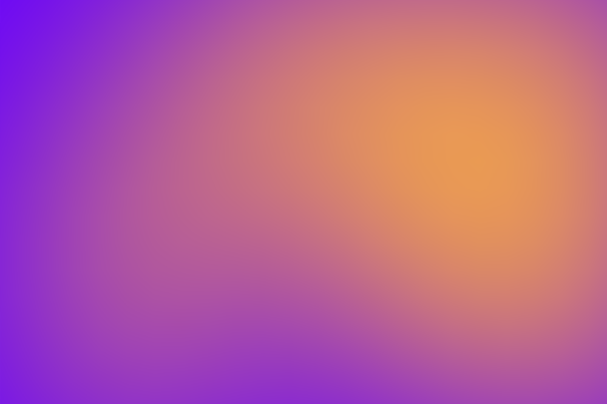
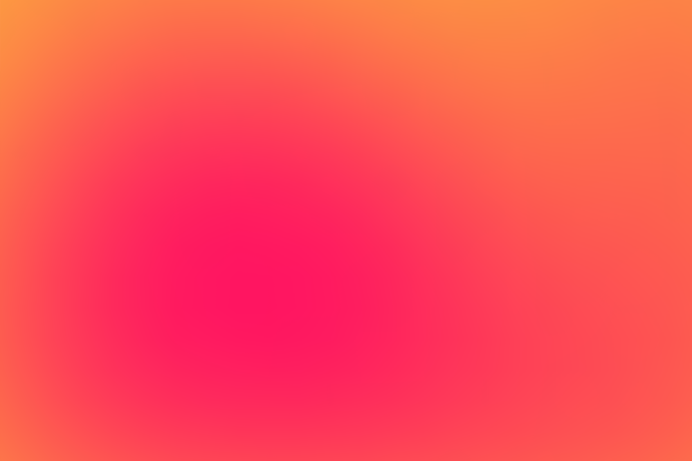
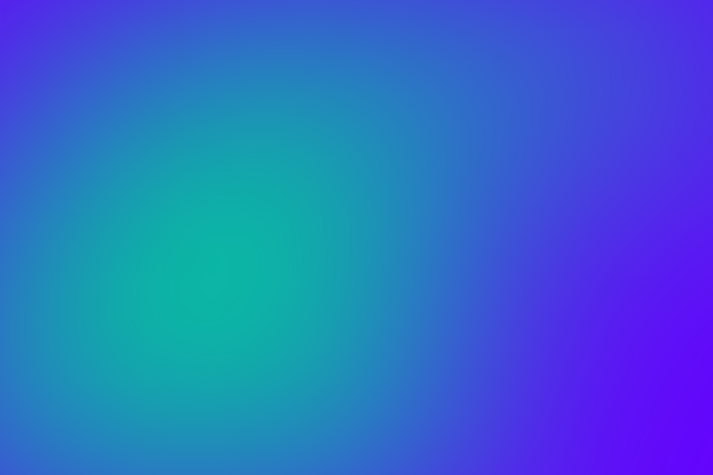

Le immagini sono fondamentali per spiegare concetti fisici complessi. Open
Physica offre strumenti avanzati per gestirle al meglio, inclusi zoom,
didascalie e supporto nativo per SVG tematici.

## Organizzazione dei File

Per mantenere il progetto ordinato e scalabile, crea una cartella `images`
all'interno della directory del contenuto.

```
content/docs/physics-2/electrostatics/
├── images/                  <-- Cartella dedicata
│   ├── gauss-surface.png
│   └── flux-diagram.svg
└── gauss-law.it.mdx         <-- Il tuo file MDX
```

In questo modo, i file di contenuto rimangono puliti e le risorse sono
facilmente rintracciabili.

## Inserire Immagini

La sintassi è quella standard di Markdown, con alcune "estensioni" speciali per
gestire dimensioni e didascalie.

### Sintassi Base

```mdx

```

### Didascalie (Caption)

Per aggiungere una didascalia visibile sotto l'immagine, usa il **titolo** del
link Markdown (la parte tra virgolette dopo il percorso).

```mdx

```



### Ridimensionamento (Size)

Puoi controllare la dimensione massima dell'immagine aggiungendo un "tag"
speciale alla fine del testo alternativo (alt text).

I tag disponibili sono:

- `#small`: Larghezza massima ~320px (ottimo per diagrammi semplici o icone)
- `#medium`: Larghezza massima ~450px (default se non specificato)
- `#large`: Larghezza 100% del contenitore (per grafici complessi o screenshot)

**Esempi:**

```mdx


```

## Diagrammi Vettoriali (SVG)

Per i diagrammi di fisica (vettori, circuiti, forze), **l'uso di SVG è
fortemente raccomandato**. Gli SVG sono nitidi a qualsiasi risoluzione e, grazie
alle nostre variabili CSS, si adattano automaticamente al tema Chiaro/Scuro.

### Variabili CSS Globali

Quando crei un SVG, non usare colori esadecimali statici (es. `#000000`). Usa
invece le nostre variabili CSS per garantire la leggibilità in entrambi i temi.

| Colore          | Variabile CSS        | Utilizzo Tipico                                 |
| :-------------- | :------------------- | :---------------------------------------------- |
| **Nero/Bianco** | `var(--svg-black)`   | Assi, testo, linee principali del corpo         |
| **Bianco/Nero** | `var(--svg-white)`   | Sfondi, riempimenti di oggetti solidi           |
| **Grigio**      | `var(--svg-gray)`    | Linee di costruzione, griglie secondarie        |
| **Rosso**       | `var(--svg-red)`     | Forze, errori, polo negativo                    |
| **Blu**         | `var(--svg-blue)`    | Velocità, campo magnetico (B)                   |
| **Verde**       | `var(--svg-green)`   | Spostamento, campo elettrico (E), polo positivo |
| **Giallo**      | `var(--svg-yellow)`  | Corrente (I), evidenziazioni                    |
| **Magenta**     | `var(--svg-magenta)` | Momento angolare, grandezze derivate            |
| **Ciano**       | `var(--svg-cyan)`    | Flusso, superfici gaussiane                     |

### Generare SVG con l'IA

Il modo più rapido per ottenere SVG è chiedere a un LLM. Abbiamo preparato un
prompt specifico ottimizzato per il nostro design system.

Vai alla pagina **[Prompt per AI](../ai-prompt#prompt-per-svg)** per copiarlo.

### ImageGrid

Per affiancare più immagini (o SVG), usa il componente `<ImageGrid>`.

<Tabs items={["Risultato", "Codice"]}>
  <Tab value="Risultato">
    <ImageGrid columns={2}>
      
      
    </ImageGrid>

  </Tab>
  <Tab value="Codice">
    ```mdx
    <ImageGrid columns={2}>
      
      
    </ImageGrid>
    ```
  </Tab>
</Tabs>
    
  
<Tabs items={["Risultato", "Codice"]}>
  <Tab value="Risultato">
    <ImageGrid columns={3}>
      
      
      
    </ImageGrid>

  </Tab>
  <Tab value="Codice">
    ```mdx
    <ImageGrid columns={3}>
      
      
      
    </ImageGrid>
    ```

  </Tab>
</Tabs>

## Proprietà (Props)

### `<ImageGrid>`

<TypeTable
  type={{
    columns: {
      description: "Numero di colonne della griglia",
      type: "number",
      default: "2",
    },
    children: {
      description: "Lista di immagini (Markdown o componenti)",
      type: "ReactNode",
      required: true,
    },
  }}
/>
