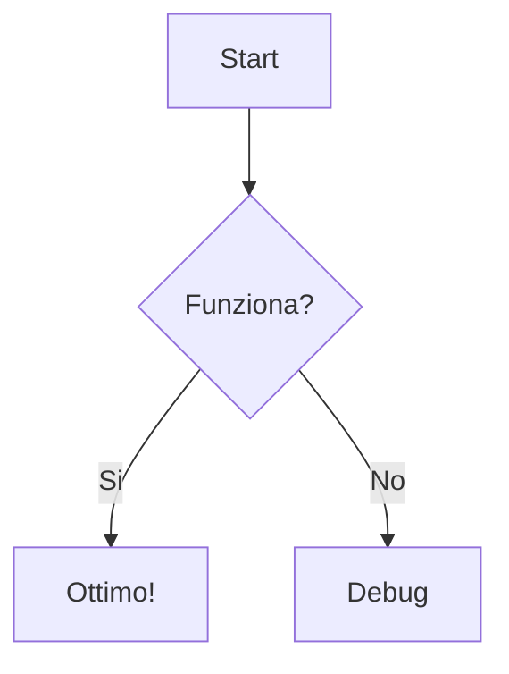

Mermaid permette di creare diagrammi e flowchart scrivendo semplice testo. È
ottimo per visualizzare processi, gerarchie o sequenze logiche.

## Sintassi Base

Usa il componente `<Mermaid>` e passa il codice del diagramma nella prop
`chart`. Usa i backtick (\`) per scrivere il codice su più righe.

<Tabs items={["Risultato", "Codice"]}>
  <Tab value="Risultato">
    <Mermaid
      chart={`
      graph TD
        A[Partenza] --> B{Condizione?}
        B -- Sì --> C[Azione 1]
        B -- No --> D[Azione 2]
        C --> E[Fine]
        D --> E
    `}
    />
  </Tab>
  <Tab value="Codice">
    ```mdx
    <Mermaid
      chart={`
      graph TD
        A[Partenza] --> B{Condizione?}
        B -- Sì --> C[Azione 1]
        B -- No --> D[Azione 2]
        C --> E[Fine]
        D --> E
    `}
    />
    ```
  </Tab>
</Tabs>

## Blocchi di Codice

Puoi anche usare la sintassi dei blocchi di codice standard di Markdown
specificando il linguaggio `mermaid`. Questo metodo è spesso più leggibile.

````mdx

````


## Tipi di Diagrammi Comuni

### Flowchart (Processi)

`graph TD` (Top-Down) o `graph LR` (Left-Right).

### Sequence Diagram (Sequenze Temporali)

Utile per protocolli o interazioni.

<Tabs items={["Risultato", "Codice"]}>
  <Tab value="Risultato">
    <Mermaid
      chart={`
      sequenceDiagram
        Alice->>Bob: Ciao Bob, come stai?
        Bob-->>Alice: Bene grazie!
    `}
    />
  </Tab>
  <Tab value="Codice">
    ```mdx
    <Mermaid
      chart={`
      sequenceDiagram
        Alice->>Bob: Ciao Bob, come stai?
        Bob-->>Alice: Bene grazie!
    `}
    />
    ```
  </Tab>
</Tabs>

Per la sintassi completa, consulta la
[documentazione ufficiale di Mermaid](https://mermaid.js.org/intro/).
