## Esempio introduttivo

Un esempio immediato e intuitivo di serie convergente è dato dalla somma delle
potenze inverse di 2:

$$
1 + \frac{1}{2} + \frac{1}{4} + \frac{1}{8} + \frac{1}{16} + \dots = \sum_{k=0}^{\infty} \frac{1}{2^k} = 2
$$

Infatti, immaginiamo di partire da un **quadrato di lato 2** (area totale = 4).

- Prendiamo **metà** del quadrato: otteniamo un rettangolo di area
  $$2 = 2 \cdot 1$$
- Di questa metà, prendiamo **la metà** (cioè $$\frac{1}{4}$$ del totale): area
  $$1$$
- Della parte rimanente, prendiamo di nuovo **la metà**: area $$\frac{1}{2}$$
- E così via...

Se sommiamo tutte queste aree:

$$
2 + 1 + \frac{1}{2} + \frac{1}{4} + \dots = 4
$$

che è esattamente l'area del quadrato!

Dividendo tutto per 2, otteniamo:

$$
1 + \frac{1}{2} + \frac{1}{4} + \frac{1}{8} + \dots = 2
$$

## Il paradosso di Zenone: Achille e la tartaruga

Un'applicazione storica fondamentale per comprendere la necessità delle serie
infinite è il **paradosso di Zenone**. Ideato da Zenone di Elea nel V secolo
a.C., questo paradosso mirava a dimostrare, tramite una logica stringente ma
apparentemente assurda, che il movimento è in realtà un'illusione.

Assumiamo che la velocità della tartaruga $v_T$ sia minore della velocità di
Achille $v_A$:

$$
v_T < v_A
$$

All'inizio ($t=0$), la tartaruga ha un vantaggio $d_0$ rispetto ad Achille.
Dall'esperienza quotidiana, sappiamo con certezza che Achille, avendo velocità
superiore, prima o poi la raggiungerà e la supererà. Eppure, seguendo il
ragionamento di Zenone, sembra emergere una contraddizione logica.

Dividiamo il moto di Achille in "inseguimenti" successivi:

1. **Il primo inseguimento:** Achille deve percorrere la distanza iniziale $d_0$
   per raggiungere la posizione in cui si trovava la tartaruga alla partenza. Il
   tempo impiegato è:

$$
t_0 = \frac{d_0}{v_A}
$$

2. **Il secondo inseguimento:** In questo intervallo di tempo $t_0$, tuttavia,
   la tartaruga non è rimasta ferma; ha percorso una piccola distanza $d_1$:

$$
d_1 = t_0 v_T
$$

Achille deve ora coprire questa nuova distanza $d_1$. Il tempo necessario è:

$$
t_1 = \frac{d_1}{v_A} = \frac{t_0 v_T}{v_A} = t_0 \left(\frac{v_T}{v_A}\right)
$$

E così via per i passi successivi. La tartaruga percorre un ulteriore tratto
$d_2$ nel tempo $t_1$:

$$
d_2 = t_1 v_T
$$

Achille impiegherà un tempo $t_2$ per coprire questa distanza:

$$
t_2 = \frac{d_2}{v_A} = t_0 \left(\frac{v_T}{v_A}\right)^2
$$

3. **l'n-esimo inseguimento:** Generalizzando, l'n-esimo intervallo di tempo
   necessario ad Achille per raggiungere la posizione precedente della tartaruga
   è:

$$
t_n = t_0 \left(\frac{v_T}{v_A}\right)^n
$$

La nuova distanza che la tartaruga percorre in questo tempo genererà il passo
successivo:

$$
d_{n+1} = t_n v_T \implies t_{n+1} = \frac{d_{n+1}}{v_A} = t_n \frac{v_T}{v_A}
$$

Il tempo totale $T$ necessario ad Achille per raggiungere la tartaruga è la
somma di tutti questi intervalli infiniti:

$$
T = t_0 + t_1 + t_2 + \dots + t_n + \dots
$$

$$
T = t_0 + t_0 \frac{v_T}{v_A} + t_0 \left(\frac{v_T}{v_A}\right)^2 + \dots + t_0 \left(\frac{v_T}{v_A}\right)^n + \dots
$$

$$
T = t_0 \left( 1 + \frac{v_T}{v_A} + \left(\frac{v_T}{v_A}\right)^2 + \dots + \left(\frac{v_T}{v_A}\right)^n + \dots \right)
$$

$$
T = t_0 \sum_{k=0}^{\infty} \left(\frac{v_T}{v_A}\right)^k
$$

### La soluzione del mistero

Questa somma infinita di termini è un esempio perfetto di **serie geometrica**.
Zenone sosteneva che Achille non avrebbe mai raggiunto la tartaruga perché
avrebbe dovuto compiere infiniti passi in un tempo infinito.

Tuttavia, il calcolo della serie smentisce questa conclusione: poiché la
velocità della tartaruga è inferiore a quella di Achille ($v_T < v_A$), il
rapporto $q = v_T/v_A$ è minore di 1 ($q < 1$). Questo è il requisito
fondamentale affinché la serie converga a un **valore finito**.

La scoperta che una somma di infiniti termini può restare "confinata" entro un
limite finito risolve il paradosso: Achille raggiunge la tartaruga esattamente
nel tempo $T$, dimostrando che la nostra intuizione fisica può essere conciliata
con il rigore matematico delle serie.

## Definizioni formali

Per analizzare una serie in modo rigoroso, dobbiamo guardare oltre la semplice
"somma di infiniti termini" e studiare come si comporta il risultato man mano
che aggiungiamo un addendo alla volta.

<section id="serie-numerica">

<Statement type="definition" title="Serie Numerica">

Data una successione di numeri reali $\{a_n\}_{n \in \mathbb{N}}$, si definisce
**serie numerica** la somma formale degli infiniti termini della successione:

$$
\sum_{n=0}^{\infty} a_n = a_0 + a_1 + a_2 + \dots
$$

</Statement>

</section>

<section id="successione-ridotte">

<Statement type="definition" title="Successione delle somme parziali">

Sia $\{a_k\}_{k \in \mathbb{N}}$ una successione di numeri reali. Si definisce
**successione delle somme parziali** (o **successione delle ridotte**) la
successione $\{S_n\}_{n \in \mathbb{N}}$ i cui termini sono definiti da:

$$
S_n = a_0 + a_1 + \dots + a_n = \sum_{k=0}^{n} a_k
$$

Formalmente, una serie numerica $\sum a_k$ si identifica come la coppia di
successioni $(\{a_k\}, \{S_n\})$.

</Statement>

</section>

### Il carattere di una serie

Studiare il **carattere** di una serie significa indagare il comportamento del
limite della successione delle sue somme parziali $S_n$ per $n \to \infty$.

Si possono presentare tre casi distinti:

<section id="serie-convergente">

<Statement type="definition" title="Serie Convergente">

Se esiste ed è finito il limite della successione delle ridotte:

$$
\lim_{n \to \infty} S_n = S \in \mathbb{R}
$$

si dice che la serie è **convergente** e ha per **somma** il valore $S$. In tal
caso scriviamo $\sum_{k=0}^{\infty} a_k = S$.

</Statement>

</section>

<section id="serie-divergente">

<Statement type="definition" title="Serie Divergente">

Se il limite della successione delle ridotte è infinito:

$$
\lim_{n \to \infty} S_n = +\infty \quad \text{oppure} \quad \lim_{n \to \infty} S_n = -\infty
$$

si dice che la serie è **divergente** (positivamente o negativamente).

</Statement>

</section>

<section id="serie-irregolare">

<Statement type="definition" title="Serie Irregolare">

Se il limite della successione delle ridotte **non esiste**, si dice che la
serie è **irregolare** (o **indeterminata**). Un esempio classico è la serie di
Grandi: $\sum_{n=0}^{\infty} (-1)^n = 1 - 1 + 1 - 1 + \dots$

</Statement>

</section>
